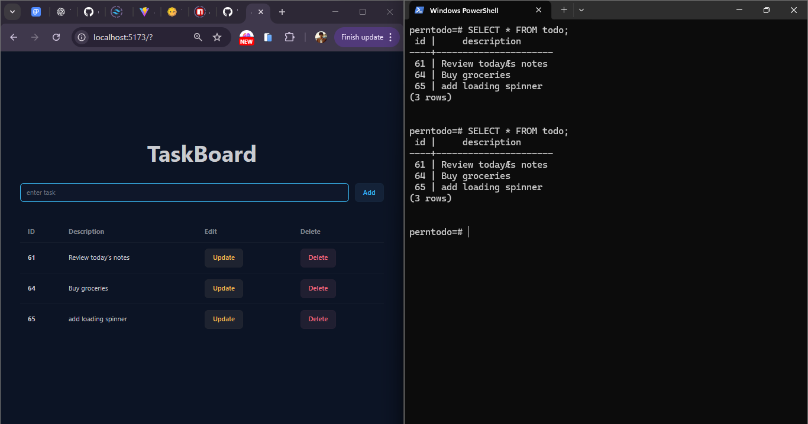

# Task Manager (PERN Stack)



A simple **Task Manager** web application built with the **PERN stack** (PostgreSQL, Express, React, Node.js).  
This app allows users to **add, update, and delete tasks**, with all data stored in a **PostgreSQL database**. The frontend is built with React, and the backend API is powered by Express and Node.js.

---

## Features

- Add new tasks
- Update existing tasks
- Delete tasks
- Tasks are stored in PostgreSQL
- Real-time UI updates
- Responsive design with React

---

## Tech Stack

- **Frontend:** React.js
- **Backend:** Node.js, Express.js
- **Database:** PostgreSQL
- **Packages:** `pg`, `cors`
- **Development Tools:** `nodemon`

---

## Installation & Setup

### 1. Clone the repository

```bash
git clone <your-repo-url>
cd <your-repo-folder>
```

## Backend Setup

```bash
cd backend
npm install
```

- Make sure PostgreSQL is installed and running.
- Update database connection in config/db.js as needed.

## Frontend Setup

```bash
cd frontend
npm install
```

## Running the Project

- Start Backend Server

```bash
   cd backend
   nodemon index.js
```

## Start Frontend

```bash
cd frontend
npm start
```

- The backend runs on http://localhost:3000 (default)

Notes

- cors is used to allow communication between frontend and backend.
- pg is used to connect to PostgreSQL.
- nodemon is used for auto-restarting the server during development.
